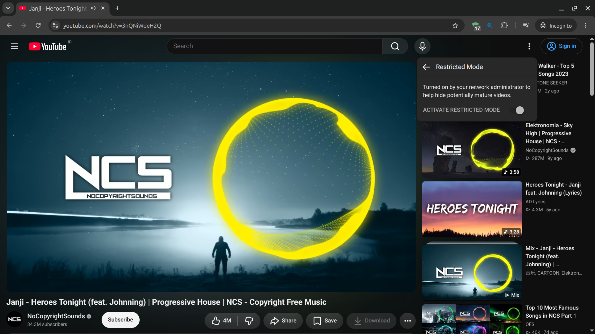
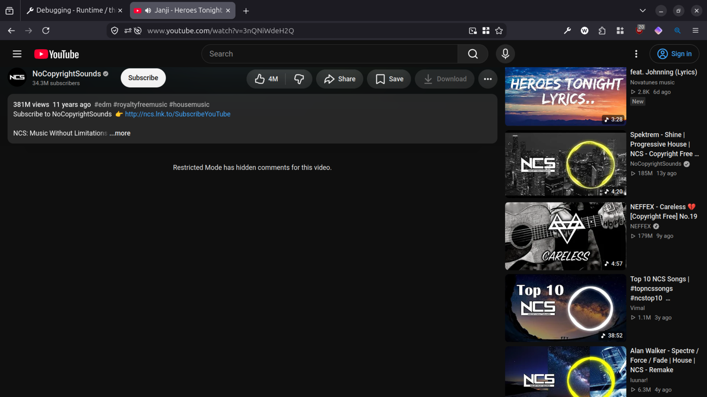

#  SafeSearch Lock for YouTube
Chromium and Firefox extension for locking Restricted Mode feature on YouTube

-----

<p align="center">
<a href=""></a>
<a href="https://addons.mozilla.org/addon/safesearch-lock-for-youtube-for-youtube/"></a>
<a href="https://microsoftedge.microsoft.com/addons/detail/dobikpbchjolpmckdpfmnagjeonmdmbl"></a>
</p>


## Contents
- [Installation](#installation)
- [How to use this extension?](#how-to-use-this-extension)
- [How this extension work?](#how-this-extension-work)
- [Development](#development)
  - [Prerequisites](#prerequisites)
  - [Getting started](#getting-started)
- [Privacy policy](#privacy-policy)
- [License](#license)

-----




-----

# Installation
1. Chromium-based Browser (Google Chrome, Opera, Brave, Vivaldi, Arc, etc.) - [Chrome Web Store]()
2. Firefox - [Mozilla Add-ons](https://addons.mozilla.org/addon/safesearch-lock-for-youtube/)
3. Microsoft Edge - [Microsoft Edge Addons](https://microsoftedge.microsoft.com/addons/detail/dobikpbchjolpmckdpfmnagjeonmdmbl)
4. GitHub Releases - [Download from releases](https://github.com/arfshl/safesearch-lock-for-youtube/releases/latest), enable "Developer Mode" options, and install from "Load Unpacked" options

# How to use this extension?

Just install the extension, or deploy it if you are an administrator. The extension will take effect once you installed it

[How to Deploy extension on Chrome](https://chromeenterprise.google/policies/extension-install-forcelist/)

[How to Deploy extension on Firefox](https://support.mozilla.org/en-US/kb/deploying-firefox-with-extensions)

# How this extension work?
This extension uses `declarativeNetRequest` API and its slatic rules to insert an HTTP header into specified YouTube domain, locking the Restricted Mode settings to strict.

Official documentations:

https://knowledge.workspace.google.com/admin/youtube/control-youtube-content-available-to-users

# Development
### Prequisites
1. `zip` and `unzip`
2. `imagemagick` and `inkscape` for generating and/or resizing icons and screenshots (optional)
3. Chromium-based and Firefox-based browser for testing

### Getting started
1. Clone the Repository
```bash
git clone https://github.com/arfshl/safesearch-lock-for-youtube.git
cd safesearch-lock-for-youtube
```

2. Build the extension
```bash
bash build.sh
```

# Privacy Policy
This extension doesn't use any external services to operate, all functionality are running locally inside your browser, no data is sent or collected by me as developer.

In order to operate, this extension need access to:

1. "Block content on any page" - `declarativeNetRequest` API: For inserting an HTTP header into specified YouTube domain, locking the Restricted Mode settings to strict.

# License
[GPLv3](https://github.com/arfshl/safesearch-lock-for-youtube/blob/main/LICENSE)
